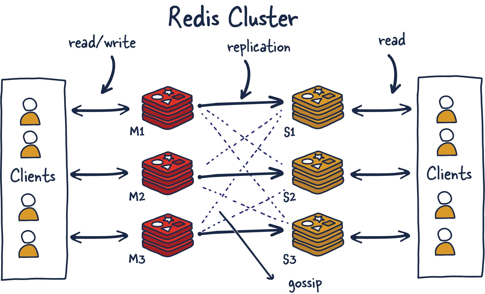
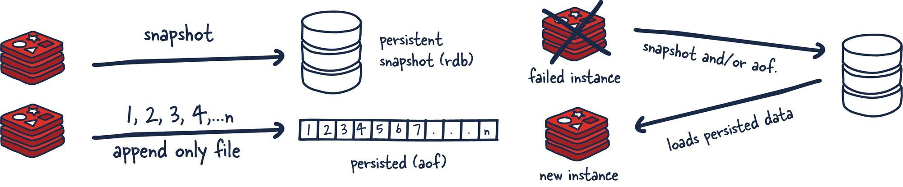
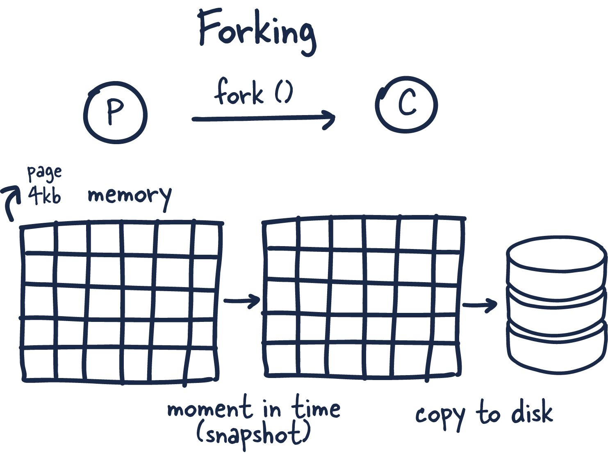

# Technical Deep Dive

# Redis

## What is Redis?
Redis (“REmote DIctionary Service”) is an **open-source key-value database server**.

The most accurate description of Redis is that it's a **data structure server**. This specific nature of Redis has led to much of its popularity and adoption amongst developers.

Primarily, Redis is an in-memory database **used as a cache in front of another "real" database like MySQL** or PostgreSQL to help improve application performance. It leverages the speed of memory and alleviates load off the central application database for:

- Data that changes infrequently  and is requested often
- Data that is less mission-critical and is frequently evolving.

Examples of above data can include session or data caches and leaderboard or roll-up analytics for dashboards.

However, for many use cases, **Redis offers enough guarantees that it can be used as a full-fledged primary database**. Coupled with Redis plug-ins and its various High Availability (HA) setups, Redis as a database has become incredibly useful for certain scenarios and workloads.

Another important aspect is that Redis blurred the lines between a cache and datastore. Important note to understand here is that **reading and manipulating data in memory is much faster than anything possible in traditional datastores using SSDs or HDDs**.

Redis is most commonly compared to Memcached. Here is a current breakdown of capabilities between Redis and Memcache.

## Redis Architectures

Let's discuss the various Redis deployments and their trade-offs.

We will be focusing mainly on these configurations:

1. Single Redis Instance
2. Redis HA
3. Redis Sentinel
4. Redis Cluster

Depending on your use case and scale, you can decide to use one setup or another.

### Single Redis Instance

Single Redis instance is the most straightforward deployment of Redis. It allows users to set up and run small instances that can help them grow and speed up their services. However, this deployment isn't without shortcomings. For example, if this instance fails or is unavailable, all client calls to Redis will fail and therefore degrade the system's overall performance and speed.

Given enough memory and server resources, this instance can be powerful. A scenario primarily used for caching could result in a significant performance boost with minimal setup. Given enough system resources, you could deploy this Redis service on the same box the application is running.

Understanding a few Redis concepts on managing data within the system is essential. Commands sent to Redis are first processed in memory. Then, if persistence is set up on these instances, there is a forked process on some interval that facilitates data persistence RDB (very compact point-in-time representation of Redis data) snapshots or AOF (append-only files).

These two flows allow Redis to have long-term storage, support various replication strategies, and enable more complicated topologies. If Redis isn't set up to persist data, data is lost in case of a restart or failover. If the persistence is enabled on a restart, it loads all of the data in the RDB snapshot or AOF back into memory, and then the instance can support new client requests.

With that said, let us look into more distributed Redis setups you might want to use.

### Redis HA

Another popular setup with Redis is the main deployment with a secondary deployment that is kept in sync with replication.  As data is written to the main instance it sends copies of those commands, to a replica client output buffer for secondary instances which facilitates replication. The secondary instances can be one or more instances in your deployment. These instances can help scale reads from Redis or provide failover in case the main is lost.

There are several new things to consider in this topology since we have now entered a distributed system that has many fallacies you need to consider. Things that were previously straightforward are now more complex.

### Redis Sentinel

Sentinel is a distributed system. As with all  distributed systems, Sentinel comes with several advantages and disadvantages. Sentinel is designed in a way where there is a cluster of sentinel processes working together to coordinate state to provide high availability for Redis. Afterall you wouldn't want the system protecting you from failure to have its own single point of failure.

Sentinel is responsible for a few things. First, it ensures that the current main and secondary instances are functional and responding. This is necessary because sentinel (with other sentinel processes) can alert and act on situations where the main and/or secondary nodes are lost. Second, it serves a role in service discovery much like Zookeeper and Consul in other systems. So when a new client attempts to write something to Redis,  Sentinel will tell the client what current main instance is.

So sentinels are constantly monitoring availability and sending out that information to clients so they are able to react to them if they indeed do failover.

Here are its responsibilities:

1. Monitoring — ensuring main and secondary instances are working as expected.
2. Notification — notify system admins about occurrences in the Redis instances.
3. Failover management — Sentinel nodes can start a failover process if the primary instance isn't available and enough (quorum of) nodes agree that is true.
4. Configuration management — Sentinel nodes also serve as a point of discovery of the current main Redis instance.

Using Redis Sentinel in this way allows for failure detection. This detection involves multiple sentinel processes agreeing that current main instance is no longer available. This agreement process is called Quorum. This allows for increased robustness and protection against one machine misbehaving and being unable to reach the main Redis node.

### Redis Cluster

I am sure many have thought about what happens when you can't store all your data in memory on one machine. Currently, the maximum RAM available in a single server is 24TIB, presently listed online at AWS. Granted, that's a lot, but for some systems, that isn't enough, even for a caching layer.

Redis Cluster allows for the horizontal scaling of Redis.

once we decide to use Redis Cluster, we have decided to spread the data we are storing across multiple machines, known as sharding. So each Redis instance in the cluster is considered a shard of the data as a whole.

This brings about a new problem. If we push a key to the cluster, how do we know which Redis instance (shard) is holding that data? There are several ways to do this, but Redis Cluster uses algorithmic sharding.

To find the shard for a given key, we hash the key and mod the total result by the number of shards. Then, using a deterministic hash function, meaning that a given key will always map to the same shard, we can reason about where a particular key will be when we read it in the future.

What happens when we later want to add a new shard into the system? This process is called resharding.

Assuming the key 'foo' was mapped to shard zero after introducing a new shard, it may map to shard five. However, moving data around to reflect the new shard mapping would be slow and unrealistic if we need to grow the system quickly. It also has adverse effects on the availability of the Redis Cluster.

Redis Cluster has devised a solution to this problem called Hashslot, to which all data is mapped. There are 16K hashslot. This gives us a reasonable way to spread data across the cluster, and when we add new shards, we simply move hashslots across the systems. By doing this, we just need to move hashlots from shard to shard and simplify the process of adding new primary instances into the cluster.

This is possible without any downtime, and minimal performance hit. Let's talk through an example.

M1 contains hashslots from 0 to 8191.

M2 contains hashslots from 8192 to 16383.

So to map `foo', we take a deterministic hash of the key (foo) and mod it by the number of hash slots(16K), leading to a mapping of M2. Now let's say we add a new instance, M3. The new mappings would be

M1 contains hashslots from 0 to 5460.

M2 contains hashslots from 5461 to 10922.

M3 contains hashslots from 10923 to 16383.

All the keys that mapped the hashslots in M1 that are now mapped to M2 would need to move. But the hashing for the individual keys to hashslots wouldn't need to move because they have already been divided up across hashslots. So this one level of misdirection solves the resharding issue with algorithmic sharding.

#### Gossiping
Redis Cluster uses gossiping to determine the entire cluster's health. In the illustration above, we have 3 M nodes and 3 S nodes. All these nodes constantly communicate to know which shards are available and ready to serve requests. If enough shards agree that M1 isn't responsive, they can decide to promote M1's secondary S1 into a primary to keep the cluster healthy. The number of nodes needed to trigger this is configurable, and it is essential to get this right. If you do it improperly, you can end up in situations where the cluster is split if it cannot break the tie when both sides of a partition are equal. This phenomenon is called split brain. As a general rule, it is essential to have an odd number of primary nodes and two replicas each for the most robust setup.

## Redis Persistence Models

If we are going to use Redis to store any kind of data for safe keeping, it's important to understand how Redis is doing it.

### No persistence
No persistence: If you wish, you can disable persistence altogether. This is the fastest way to run Redis and has no durability guarantees.

### RDB Files
RDB (Redis Database): The RDB persistence performs point-in-time snapshots of your dataset at specified intervals.

The main downside to this mechanism is that data between snapshots will be lost. In addition, this storage mechanism also relies on forking the main process, and in a larger dataset, this may lead to a momentary delay in serving requests. That being said, RDB files are much faster being loaded in memory than AOF.

### AOF
AOF (Append Only File): The AOF persistence logs every write operation the server receives that will be played again at server startup, reconstructing the original dataset.

This way of ensuring persistence is much more durable than RDB snapshots since it is an append-only file. As operations happen, we buffer them to the log, but they aren't persisted yet. This log consistents of the actual commands we ran in order for replay when needed.

Then when possible, we flush it to disk with fsync (when this runs is configurable), it will be persisted. The downside is that the format isn't compact and uses more disk than RDB files.

### Why not both?
RDB + AOF: It is possible to combine AOF and RDB in the same Redis instance. If durability in exchange for some speed is a tradeoff, you are willing to make it. I think this is an acceptable way to set up Redis. **In the case of a restart, remember that if both are enabled, Redis will use AOF to reconstruct the data since it's the most complete.**

## Forking
Now that we understand the types of persistence, let’s discuss how we actually go about doing it in a **single threaded application like Redis**.

This coolest part of Redis in my opinion is how **it leverages forking and copy-on-write to facilitate data persistence performantly**.

Forking is a way for operating systems to **create new processes by creating copies of themselves**. With this, you get a new process ID and a few other bits of information and handles, so the newly forked process (child) can talk to the original process parent.

Now here is where things get interesting. Redis is a process with tons of memory allocated to it, so how does it make a copy without running out of memory?

**When you fork a process, the parent and child share memory, and in that child process Redis begins the snapshotting (Redis) process. This is made possible by a memory sharing technique called copy-on-write which passses references to the memory at the time the fork was created. If no changes occur while the child process is persisting to disk, no new allocations are made.**

**In the case where there are changes, the kernel keeps track of references to each page, and if there are more than one to specific page the changes are written to new pages. The child process is fully unaware of the change and has consistent memory snapshot.** Therefore only fraction of the memory is used and we are able to achieve a point in time snapshot of potentially gigabytes of memory extremely quickly and efficiently!
