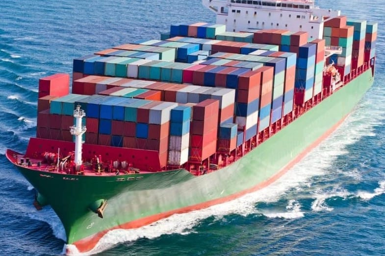
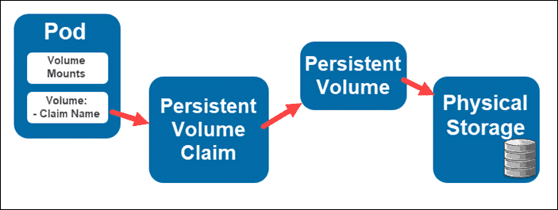
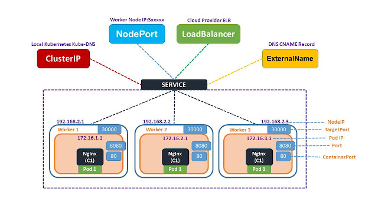
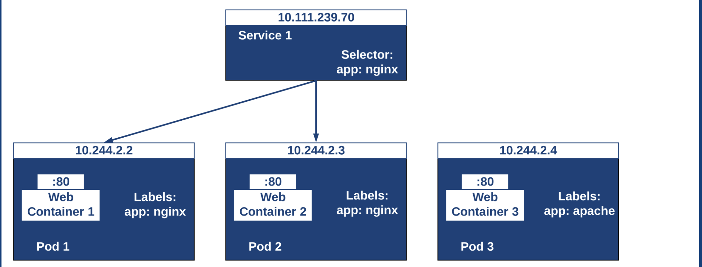

# Kubernetes — Deep dive
- The name Kubernetes originates from Greek and means **helmsman or pilot**.
- "K8s (or "ks" in some articles), is an abbreviation derived by replacing the eight letters "ubernete" with "8."

If you are wondering why the name Kubernetes which means "helmsman" was chosen, then let's take a look at the following figure.



Therefore, taking the cue from its literal meaning, Kubernetes hopes to become a ship that transports containers. In other words, it intends to help manage these containers.

## What is Docker?
- Docker is a platform which **packages an application and all its dependencies together in the form of containers**.
- This containerization aspect of Docker ensures that the application works in any environment.


**Kubernetes uses Docker as the underlying container platform**.

## What Is Kubernetes?
Kubernetes is an **automated container orchestration platform**, which is responsible for deploying, elastically scaling, and managing applications based on containers.

## Core Features of Kubernetes


The following sections describe the key capabilities of Kubernetes

### 1) Scheduling
- The scheduler in Kubernetes control plane is the component that implements this capability.
- A container submitted by a user is deployed onto a node in a cluster managed by Kubernetes.
- It monitors the size and specifications of the container that is being scheduled.
- A pod can be pinned to a particular node.


### 2) Automatic Recovery
- Kubernetes provides node health check. This feature allows the system to monitor all hosts in the cluster.
- When a host or software problem occurs, Kubernetes automatically detects the fault and automatically migrates containers that are running on the failed node to a healthy host to automatically recover the containers in the cluster.


### 3) Horizontal Scaling
- Kubernetes is capable of checking service loads through monitoring.
- If the CPU usage of service is excessively high or the response to service is excessively slow, Kubernetes scale-out that specific service accordingly. 
- Limitations is that it does not work with DaemonSets.


## Kubernetes Architecture
- The Kubernetes architecture is a typical **two-layer server-client architecture**.
- As the central control node, the master connects to multiple nodes. All UI clients and user-side components are connected to the master to send desired states or to-be-executed commands to the master. Then, the master sends these commands or states to corresponding nodes for final execution.


In Kubernetes, the master runs four key components including the API server, controller, scheduler and etcd. The following figure shows the detailed Kubernetes architecture


- **API Server**: As the name implies, the API server processes API operations. All the other components in Kubernetes are connected to the API server. Generally, these components are not individually connected to each other. However, they depend on the API server to transmit messages to each other.
- **Controller**: The controllers shipped with Kubernetes watch and manage the cluster state. For example, in the preceding examples, the automatic recovery of containers and automatic horizontal scaling are both done by the controllers in Kubernetes.
- **Scheduler**: As the name implies, the scheduler performs scheduling. As described in the first example, the scheduler places a container submitted by a user onto an appropriate node based on the requested CPU and memory capacities.
- **etcd**: It is a distributed storage system and all original information required by the API server is stored in etcd. As a high-availability system, etcd is responsible for ensuring that all the components of the master in Kubernetes are highly available.

### Kubernetes Architecture - Nodes
- Each Node is managed by the control plane.
- A Node is a worker machine in Kubernetes and may be either a virtual or a physical machine, depending on the cluster.
- A Node can have multiple pods, and the Kubernetes control plane automatically handles scheduling the pods across the Nodes in the cluster. The control plane's automatic scheduling takes into account the available resources on each Node.

Every Kubernetes Node runs at least:
- **Kubelet**, a process responsible for communication between the Kubernetes control plane and the Node; it manages the Pods and the containers running on a machine.
- A container runtime (like **Docker**) responsible for pulling the container image from a registry, unpacking the container, and running the application.


The following example demonstrates how these components interact with each other in the Kubernetes architecture.


- A user may submit a pod deployment request to Kubernetes through the UI or CLI.
- This request is first submitted to the API server in Kubernetes through the CLI or UI.
- The API server writes the request information into the etcd store.
- Lastly, the scheduler obtains this information through the watch or notification mechanism of the API server.
- The information indicates that the pod needs to be scheduled.

At this time, the scheduler makes a scheduling decision based on its memory status. After completing the scheduling, it reports to the API server with "OK! This pod needs to be scheduled to a certain node."

- After receiving this report, the API server writes the scheduling result into etcd.
- Then, the API server notifies the corresponding node to start the pod.
- After receiving this notification, kubelet on the corresponding node communicates with container runtime to actually start configuring the container and the running environment of the container.
- In addition, kubelet schedules the storage plug-in to configure storage and the network plug-in to configure the network, respectively.

This example shows how these components communicate with each other and work together to complete the scheduling of a pod.

## Core Concepts

### 1) Pod
- Pods are the smallest deployable units of computing that you can create and manage in Kubernetes.
- A Pod (as in a pod of whales or pea pod) is a group of one or more containers, with **shared storage and network resources**, and a specification for how to run the containers.

```yaml
apiVersion: v1
kind: Pod
metadata:
  name: nginx
spec:
  containers:
  - name: nginx
    image: nginx:1.14.2
    ports:
    - containerPort: 80
```


### 2) Volume

- In Kubernetes, a volume is used to manage storage and declare the file directories that are accessed by containers in a pod.
- A volume can be mounted to the specified path of one or more containers in a pod.



### 3) Deployment
- A deployment is an **abstraction on top of a pod and defines the number of replicas for a set of pods and pod versions**.
- A Deployment runs multiple replicas of your application and automatically replaces and creates new instances against the one's which gets failed or become unresponsive. In a way it supervises the pods creation and maintains rollout and rollback activities.


### 4) Service
- An **abstract way to expose an application running on a set of Pods as a network service**.
- A service provides static IP addresses for one or more pod instances.
- For an external user, accessing any pod is the same, and therefore load balancing is preferred. To achieve load balancing, the user wants to access a static virtual IP (VIP) address rather than to know the specific IP addresses of all pods.
- For an external user, if the specific IP addresses of multiple pods are provided, this user needs to constantly update the IP addresses of pods. If a pod fails and then restarts, the abstraction may abstract the access to all pods into a third-party IP address. **The abstraction that implements this feature in Kubernetes is called service.** Kubernetes supports multiple ingress modes for services, which include the ClusterIP, NodePort, and LoadBalancer modes. It also supports access through networking by using kube-proxy.



### 5) Namespace
- A namespace is used for implementing logical isolation within a cluster, which involves authentication and resource management.
- Each resource in Kubernetes, such as the pod, deployment, and service, belongs to a namespace.
- Resource names must be unique within a namespace, but can be the same in different namespaces. 


## Kubernetes API
The following diagram describes the basics of the Kubernetes API.


- From a high-level perspective, the Kubernetes API is based on HTTP and JSON.
- Specifically, users access the API through HTTP, and the content of the accessed API is in the JSON format.
- In Kubernetes, the kubectl command-line tool, the Kubernetes UI, or sometimes curl is used to directly communicate with Kubernetes based on HTTP and JSON. In the above example, the HTTP access path of a pod consists of the following parts: the API, apiVesion: V1, namespace, pod, and pod name.


## Kubernetes – Services and Labels
- Labels enable users to map their own organizational structures onto system objects in a loosely coupled fashion, without requiring clients to store these mappings.
- Labels are key/value pairs that are attached to objects, such as pods. Labels are intended to be used to specify identifying attributes of objects that are meaningful and relevant to users, but do not directly imply semantics to the core system.



## CI/CD Architecture


