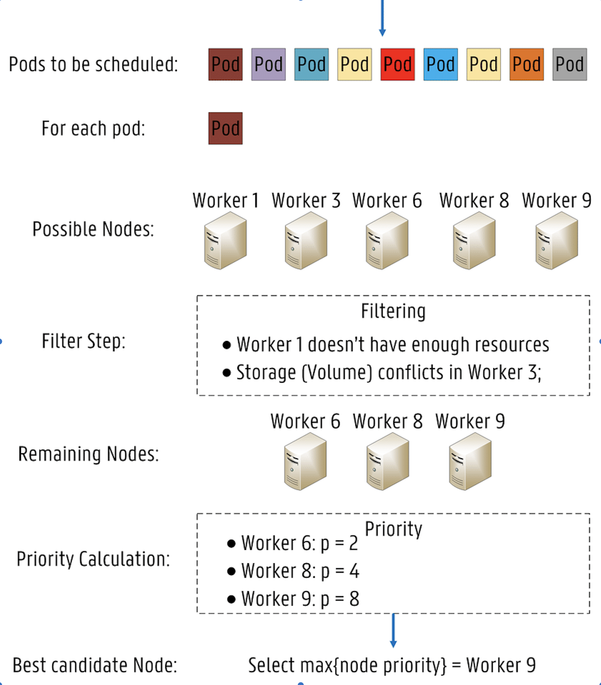
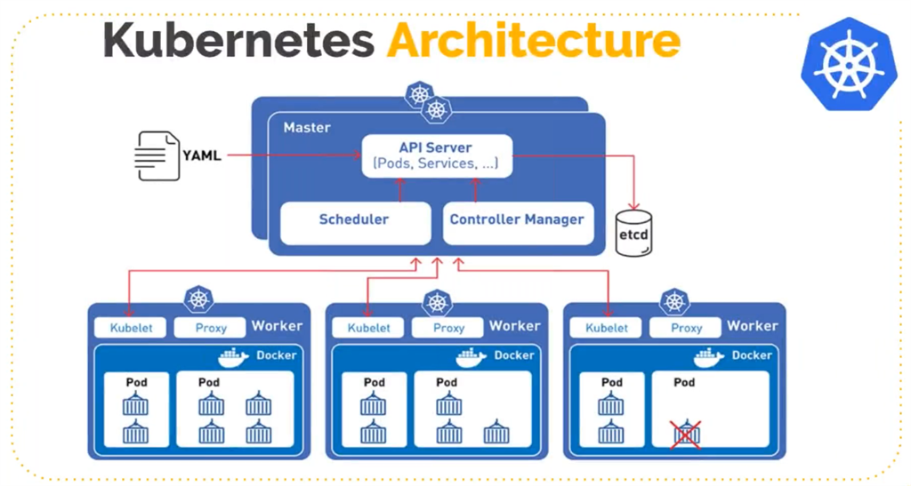

# Kubernetes — Deep dive
- The name Kubernetes originates from Greek and means **helmsman or pilot**.
- "K8s (or "ks" in some articles), is an abbreviation derived by replacing the eight letters "ubernete" with "8."

If you are wondering why the name Kubernetes which means "helmsman" was chosen, then let's take a look at the following figure.

Therefore, taking the cue from its literal meaning, Kubernetes hopes to become a ship that transports containers. In other words, it intends to help manage these containers.

## What is Docker?
- Docker is a platform which **packages an application and all its dependencies together in the form of containers**.
- This containerization aspect of Docker ensures that the application works in any environment.

**Kubernetes uses Docker as the underlying container platform**.

## What Is Kubernetes?
Kubernetes is an **automated container orchestration platform**, which is responsible for deploying, elastically scaling, and managing applications based on containers.

## Core Features of Kubernetes

The following sections describe the key capabilities of Kubernetes

### 1) Scheduling
- The scheduler in Kubernetes control plane is the component that implements this capability.
- A container submitted by a user is deployed onto a node in a cluster managed by Kubernetes.
- It monitors the size and specifications of the container that is being scheduled.
- A pod can be pinned to a particular node.

### 2) Automatic Recovery
- Kubernetes provides node health check. This feature allows the system to monitor all hosts in the cluster.
- When a host or software problem occurs, Kubernetes automatically detects the fault and automatically migrates containers that are running on the failed node to a healthy host to automatically recover the containers in the cluster.

### 3) Horizontal Scaling
- Kubernetes is capable of checking service loads through monitoring.
- If the CPU usage of service is excessively high or the response to service is excessively slow, Kubernetes scale-out that specific service accordingly. 
- Limitations is that it does not work with DaemonSets.

## Kubernetes Architecture
- The Kubernetes architecture is a typical **two-layer server-client architecture**.
- As the central control node, the master connects to multiple nodes. All UI clients and user-side components are connected to the master to send desired states or to-be-executed commands to the master. Then, the master sends these commands or states to corresponding nodes for final execution.

In Kubernetes, the master runs four key components including the API server, controller, scheduler and etcd. The following figure shows the detailed Kubernetes architecture

- **API Server**: As the name implies, the API server processes API operations. All the other components in Kubernetes are connected to the API server. Generally, these components are not individually connected to each other. However, they depend on the API server to transmit messages to each other.
- **Controller**: The controllers shipped with Kubernetes watch and manage the cluster state. For example, in the preceding examples, the automatic recovery of containers and automatic horizontal scaling are both done by the controllers in Kubernetes.
- **Scheduler**: As the name implies, the scheduler performs scheduling. As described in the first example, the scheduler places a container submitted by a user onto an appropriate node based on the requested CPU and memory capacities.
- **etcd**: It is a distributed storage system and all original information required by the API server is stored in etcd. As a high-availability system, etcd is responsible for ensuring that all the components of the master in Kubernetes are highly available.

### Kubernetes Architecture - Nodes
In Kubernetes, service loads are actually carried by nodes, with each piece of service load running as a pod. The concept of a pod will be introduced later. In addition, one or more containers are running in a pod. The component that actually runs these pods is called kubelet, which is also the most critical component on the node. It receives the running status of the desired pod from the API server and submits the running status to the container runtime component shown in the following figure.

It's critical to manage the storage and network for creating the running environment on the OS for a container and finally running the container or the pod. Kubernetes does not directly perform any storage or network operations but, depends on storage plug-ins or network plug-ins for completing these operations. Usually, users or cloud vendors develop corresponding storage plug-ins or network plug-ins to perform actual storage or network operations.

Kubernetes also includes a Kubernetes network, which provides a service network for networking. The concept of service will be introduced later. The component that truly completes service networking is kube-proxy. It sets up a cluster network in Kubernetes by leveraging iptables. So far, you have learned about all the four components on a node. In Kubernetes, a node does not directly interact with users but, depends on the master. Users deliver messages to a node through the master. In Kubernetes, each node runs all of the preceding four component

The following example demonstrates how these components interact with each other in the Kubernetes architecture.

A user may submit a pod deployment request to Kubernetes through the UI or CLI. This request is first submitted to the API server in Kubernetes through the CLI or UI. Then, the API server writes the request information into the etcd store. Lastly, the scheduler obtains this information through the watch or notification mechanism of the API server. The information indicates that the pod needs to be scheduled.

At this time, the scheduler makes a scheduling decision based on its memory status. After completing the scheduling, it reports to the API server with "OK! This pod needs to be scheduled to a certain node."

After receiving this report, the API server writes the scheduling result into etcd. Then, the API server notifies the corresponding node to start the pod. After receiving this notification, kubelet on the corresponding node communicates with container runtime to actually start configuring the container and the running environment of the container. In addition, kubelet schedules the storage plug-in to configure storage and the network plug-in to configure the network, respectively. This example shows how these components communicate with each other and work together to complete the scheduling of a pod.

## Core Concepts

Concept 1) Pod

A pod is the smallest scheduling and resource unit in Kubernetes. A user creates a pod through the Pod API of Kubernetes so that Kubernetes schedules the pod. Specifically, the pod is placed and runs on a node managed by Kubernetes. In short, a pod is the abstraction of a group of containers, containing one or more containers.

As shown in the following figure, the pod contains two containers, and each container specifies its required resource size, such as 1 GB memory and 1 CPU core, or 0.5 GB memory and 0.5 CPU core.

This pod also contains other required resources, such as the storage resource called volume, or 100 GB or 20 GB memory.

In a pod, define the way to run a container, such as running the command or the environment variable of the container. The pod also provides a shared running environment for the containers within it. In this case, these containers share a network environment and directly find each other through the localhost. In addition, pods are isolated from each other.

Concept 2) Volume

In Kubernetes, a volume is used to manage storage and declare the file directories that are accessed by containers in a pod. A volume can be mounted to the specified path of one or more containers in a pod.

The volume itself is an abstraction. One volume supports multiple types of backend storage. For example, the volume in Kubernetes supports many storage plug-ins. It supports local storage, distributed storage such as Ceph and GlusterFS, and cloud storage such as disks in Alibaba Cloud, AWS, and Google

Concept 3) Deployment

A deployment is an abstraction on top of a pod and defines the number of replicas for a set of pods and pod versions. Generally, this abstraction is used to actually manage applications, and pods are the smallest units that form a deployment. In Kubernetes, a controller maintains the number of pods in deployment and helps the deployment automatically recover failed pods. For example, define a deployment that contains two pods. If one pod fails, a corresponding controller detects the failure and restores the number of pods in the deployment from one to two by creating a pod. The controllers in Kubernetes also allow us to implement published policies, such as rolling upgrades, regeneration upgrades, or version rollback

Concept 4) Service
A service provides static IP addresses for one or more pod instances. In the preceding example, one deployment may include two or more identical pods. For an external user, accessing any pod is the same, and therefore load balancing is preferred. To achieve load balancing, the user wants to access a static virtual IP (VIP) address rather than to know the specific IP addresses of all pods. As mentioned earlier, a pod may be in the terminal go (terminated) status. If this is the case, it may be replaced by a new pod.

For an external user, if the specific IP addresses of multiple pods are provided, this user needs to constantly update the IP addresses of pods. If a pod fails and then restarts, the abstraction may abstract the access to all pods into a third-party IP address. The abstraction that implements this feature in Kubernetes is called service. Kubernetes supports multiple ingress modes for services, which include the ClusterIP, NodePort, and LoadBalancer modes. It also supports access through networking by using kube-proxy.

Concept 5) Namespace

A namespace is used for implementing logical isolation within a cluster, which involves authentication and resource management. Each resource in Kubernetes, such as the pod, deployment, and service, belongs to a namespace. Resource names must be unique within a namespace, but can be the same in different namespaces. The following describes a use case of namespaces. At Alibaba, there are many business units (BUs). To isolate each BU at the view level and make them different in authentication and compute unified device architecture (CUDA), we will use namespaces to provide each BU with such a visual isolation

## Kubernetes API
The following diagram describes the basics of the Kubernetes API. From a high-level perspective, the Kubernetes API is based on HTTP and JSON. Specifically, users access the API through HTTP, and the content of the accessed API is in the JSON format. In Kubernetes, the kubectl command-line tool, the Kubernetes UI, or sometimes curl is used to directly communicate with Kubernetes based on HTTP and JSON. In the following example, the HTTP access path of a pod consists of the following parts: the API, apiVesion: V1, namespace, pod, and pod name.

In contrast, if we submit a pod or get a pod, the content of the pod is expressed in the JSON or YAML format. The preceding figure shows a YAML file example. In this YAML file, the description of the pod consists of several parts.

Generally, the first part is the API version. In this example, the API version is V1. The second part is the kind of resource that is being worked on. For example, if the kind of the resource is a pod, the name of this pod is written in the metadata. If the kind of resource is Nginx, we will add some labels to it. The concept of a label will be described later. In metadata, sometimes we also write annotations to additionally describe the resource from the perspective of users.

Another important part is the spec, which indicates the desired state of the pod. For example, the spec shows the containers that need to be run in the pod, the image of an Nginx container included in the pod, and the ID of the exposed port.

When we obtain this resource through the Kubernetes API, the spec usually comes along with an item named status, which indicates the current state of this resource. For example, a pod may be in the scheduling, running, or terminated status. The terminated status means that the pod has been executed.

While describing the API, we mentioned an interesting metadata element called "label". A label may be a set of key-value pairs. For example, for the first pod in the following figure, the label may be color red, which indicates that the pod is red. It is also possible to add other labels, such as size big, which indicates that the size is defined as big. In addition, it is possible to add a set of labels. These labels are queried by a selector. In fact, this capability is very similar to that of an SQL select statement. For example, you may select from the three pods shown in the following figure. When the color is named red, implying that the color of a pod is red, note that only two pods are selected because only their labels indicate the red color. The label of another pod says that the color is yellow, indicating that this pod is yellow and therefore is not selected.

Labels allow the Kubernetes API to filter these resources. The filtering is also a default way to indicate a collection of resources in Kubernetes.

For example, a deployment may represent a set of pods or is an abstraction of a set of pods. This set of pods is indicated by using a label selector. As described previously, a service corresponds to one or more pods to access them in a centralized way. In this description, the set of pods are also selected by the label selector.

## CI/CD Architecture

