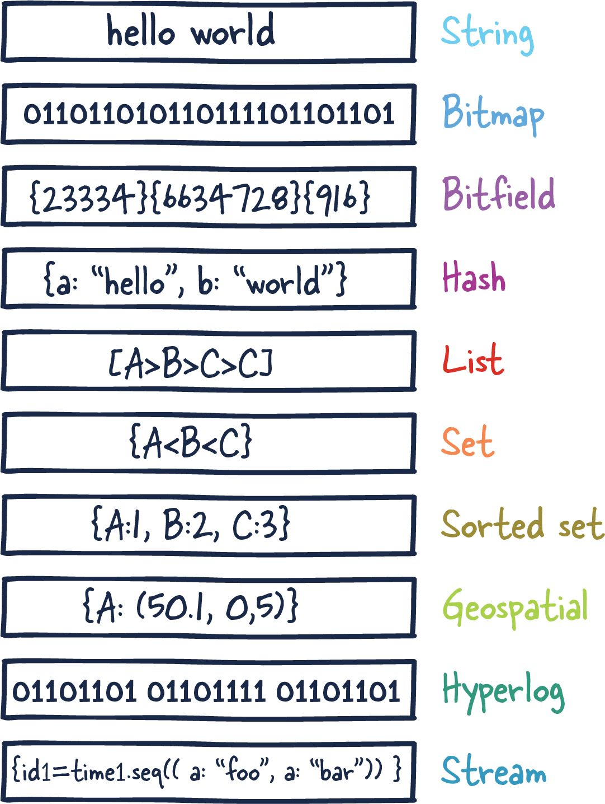

# Technical Deep Dive

# Redis

## What is Redis?
Redis (“REmote DIctionary Service”) is an **open-source key-value database server**.

The most accurate description of Redis is that it's a **data structure server**. This specific nature of Redis has led to much of its popularity and adoption amongst developers.

Primarily, Redis is an in-memory database **used as a cache in front of another "real" database like MySQL** or PostgreSQL to help improve application performance. It leverages the speed of memory and alleviates load off the central application database for:

- Data that changes infrequently  and is requested often
- Data that is less mission-critical and is frequently evolving.

Examples of above data can include session or data caches and leaderboard or roll-up analytics for dashboards.

However, for many use cases, **Redis offers enough guarantees that it can be used as a full-fledged primary database**. Coupled with Redis plug-ins and its various High Availability (HA) setups, Redis as a database has become incredibly useful for certain scenarios and workloads.

Another important aspect is that Redis blurred the lines between a cache and datastore. Important note to understand here is that **reading and manipulating data in memory is much faster than anything possible in traditional datastores using SSDs or HDDs**.

Redis is most commonly compared to Memcached. Here is a current breakdown of capabilities between Redis and Memcache.

## Redis Architectures

Let's discuss the various Redis deployments and their trade-offs.

We will be focusing mainly on these configurations:

1. Single Redis Instance
2. Redis HA
3. Redis Sentinel
4. Redis Cluster

Depending on your use case and scale, you can decide to use one setup or another.

### Single Redis Instance

Single Redis instance is the most straightforward deployment of Redis. It allows users to set up and run small instances that can help them grow and speed up their services. However, this deployment isn't without shortcomings. For example, if this instance fails or is unavailable, all client calls to Redis will fail and therefore degrade the system's overall performance and speed.

Given enough memory and server resources, this instance can be powerful. A scenario primarily used for caching could result in a significant performance boost with minimal setup. Given enough system resources, you could deploy this Redis service on the same box the application is running.

Understanding a few Redis concepts on managing data within the system is essential. Commands sent to Redis are first processed in memory. Then, if persistence is set up on these instances, there is a forked process on some interval that facilitates data persistence RDB (very compact point-in-time representation of Redis data) snapshots or AOF (append-only files).

These two flows allow Redis to have long-term storage, support various replication strategies, and enable more complicated topologies. If Redis isn't set up to persist data, data is lost in case of a restart or failover. If the persistence is enabled on a restart, it loads all of the data in the RDB snapshot or AOF back into memory, and then the instance can support new client requests.

With that said, let us look into more distributed Redis setups you might want to use.

### Redis HA

Another popular setup with Redis is the main deployment with a secondary deployment that is kept in sync with replication.  As data is written to the main instance it sends copies of those commands, to a replica client output buffer for secondary instances which facilitates replication. The secondary instances can be one or more instances in your deployment. These instances can help scale reads from Redis or provide failover in case the main is lost.

There are several new things to consider in this topology since we have now entered a distributed system that has many fallacies you need to consider. Things that were previously straightforward are now more complex.

